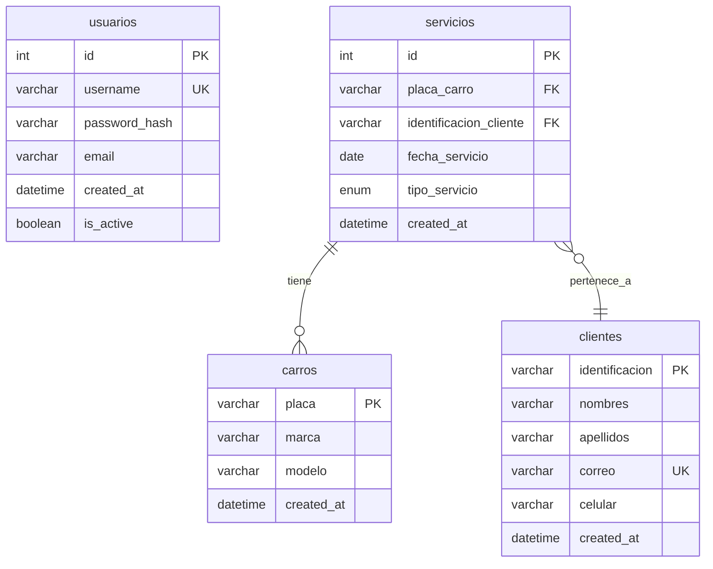

# Diseño Técnico - Aplicación Web Serviteca ADSO

## 1. Stack Tecnológico Recomendado

### Frontend: **React + TypeScript + Vite**
- **React**: Framework más popular, abundante documentación en español, curva de aprendizaje gradual para juniors
- **TypeScript**: Mejora la calidad del código, detecta errores en tiempo de compilación, facilita el mantenimiento
- **Vite**: Herramienta de desarrollo rápida, configuración simple, ideal para proyectos nuevos
- **Bootstrap 5**: Para componentes responsive con mínimo código CSS
- **React Router**: Manejo de navegación SPA

### Backend: **Node.js + Express.js + TypeScript**
- **Node.js**: JavaScript en el servidor, misma sintaxis que frontend, fácil para equipos junior
- **Express.js**: Framework minimalista para APIs REST, documentación extensa
- **TypeScript**: Consistencia con frontend, tipado fuerte en el backend
- **Express Validator**: Validación de inputs en servidor

### Base de Datos: **PostgreSQL**
- Gratuito, robusto, ideal para aplicaciones con relaciones complejas
- Buen soporte para ENUMs (tipos de servicio)
- Documentación amplia
- Alternativa: SQLite para desarrollo inicial si se prefiere simplicidad

### Autenticación: **JWT (JSON Web Tokens)**
- **jsonwebtoken**: Librería estándar para Node.js
- **bcryptjs**: Hashing de contraseñas
- Sesiones sin estado, fáciles de implementar
- Tokens almacenados en localStorage (frontend) con expiración

### Herramientas de Desarrollo
- **Git**: Control de versiones para desarrollo colaborativo
- **GitHub/GitLab**: Repositorio remoto para el proyecto
- **npm**: Gestor de paquetes (preinstalado con Node.js)
- **Vite**: Bundler y dev server para frontend
- **ESLint + Prettier**: Linting y formateo consistente
- **Postman/Insomnia**: Testing de APIs
- **pgAdmin/DBeaver**: Cliente GUI para PostgreSQL

## 2. Diagrama de Entidad-Relación (Mermaid)



### Detalles del Modelo de Datos:

**usuarios**:
- `id`: SERIAL PRIMARY KEY (auto-incremental)
- `username`: VARCHAR(50) UNIQUE NOT NULL
- `password_hash`: VARCHAR(255) NOT NULL
- `email`: VARCHAR(100) UNIQUE NOT NULL
- `created_at`: TIMESTAMP DEFAULT CURRENT_TIMESTAMP
- `is_active`: BOOLEAN DEFAULT true

**clientes**:
- `identificacion`: VARCHAR(20) PRIMARY KEY
- `nombres`: VARCHAR(100) NOT NULL
- `apellidos`: VARCHAR(100) NOT NULL
- `correo`: VARCHAR(100) UNIQUE NOT NULL
- `celular`: VARCHAR(15) NOT NULL
- `created_at`: TIMESTAMP DEFAULT CURRENT_TIMESTAMP

**carros**:
- `placa`: VARCHAR(10) PRIMARY KEY
- `marca`: VARCHAR(50) NOT NULL
- `modelo`: VARCHAR(50) NOT NULL
- `created_at`: TIMESTAMP DEFAULT CURRENT_TIMESTAMP

**servicios**:
- `id`: SERIAL PRIMARY KEY
- `placa_carro`: VARCHAR(10) NOT NULL REFERENCES carros(placa) ON DELETE RESTRICT
- `identificacion_cliente`: VARCHAR(20) NOT NULL REFERENCES clientes(identificacion) ON DELETE RESTRICT
- `fecha_servicio`: DATE NOT NULL
- `tipo_servicio`: ENUM('cambio_aceite', 'sincronizacion', 'alineacion', 'lavado') NOT NULL
- `created_at`: TIMESTAMP DEFAULT CURRENT_TIMESTAMP

**Índices adicionales**:
- `servicios(placa_carro)` para búsquedas rápidas por placa
- `servicios(fecha_servicio DESC)` para ordenar servicios recientes primero
- `clientes(correo)` para validación de unicidad

## 3. Diagrama de Arquitectura del Sistema

```
┌─────────────────┐     HTTP/HTTPS     ┌──────────────────┐     SQL     ┌───────────────┐
│                 │ ◄─────────────────► │                  │ ◄──────────► │               │
│   Navegador     │                    │   API REST       │             │   PostgreSQL  │
│   (Frontend)    │     JSON/Token     │   (Node.js +     │             │   Base de     │
│                 │                    │    Express)      │             │   Datos       │
│  • React App    │                    │                  │             │               │
│  • Bootstrap    │                    │  • Controladores │             │  • usuarios   │
│  • React Router │                    │  • Modelos       │             │  • clientes   │
│                 │                    │  • Middlewares   │             │  • carros     │
└─────────────────┘                    │  • Validación    │             │  • servicios  │
                                       └──────────────────┘             └───────────────┘
```

### Endpoints REST Principales:

**Autenticación**:
- `POST /api/auth/login` - Login de usuario (retorna JWT)
- `POST /api/auth/logout` - Logout protegido (registra evento de auditoría, frontend borra token)
- `GET /api/auth/me` - Obtener datos del usuario actual (protegido)

**Clientes**:
- `GET /api/clientes` - Listar todos los clientes (con paginación)
- `POST /api/clientes` - Crear nuevo cliente
- `GET /api/clientes/:identificacion` - Obtener cliente por identificación
- `PUT /api/clientes/:identificacion` - Actualizar cliente
- `DELETE /api/clientes/:identificacion` - Eliminar cliente (solo si no tiene servicios)

**Carros**:
- `GET /api/carros` - Listar todos los carros (con paginación)
- `POST /api/carros` - Crear nuevo carro
- `GET /api/carros/:placa` - Obtener carro por placa
- `PUT /api/carros/:placa` - Actualizar carro
- `DELETE /api/carros/:placa` - Eliminar carro (solo si no tiene servicios asociados)

**Servicios**:
- `GET /api/servicios` - Listar todos los servicios (con filtros opcionales y paginación)
- `POST /api/servicios` - Crear nuevo servicio
- `GET /api/servicios/:id` - Obtener servicio por ID
- `PUT /api/servicios/:id` - Actualizar servicio existente
- `DELETE /api/servicios/:id` - Eliminar servicio (con validación de no eliminación en lotes)
- `GET /api/servicios/carro/:placa` - Listar servicios por placa de carro
- `GET /api/servicios/cliente/:identificacion` - Listar servicios por cliente

## 4. Estructura de Carpetas del Proyecto

```
serviteca-adso/
├── backend/
│   ├── src/
│   │   ├── config/
│   │   │   ├── database.ts        # Configuración DB
│   │   │   └── server.ts          # Configuración servidor
│   │   ├── controllers/
│   │   │   ├── auth.controller.ts
│   │   │   ├── clientes.controller.ts
│   │   │   ├── carros.controller.ts
│   │   │   └── servicios.controller.ts
│   │   ├── models/
│   │   │   ├── Usuario.ts
│   │   │   ├── Cliente.ts
│   │   │   ├── Carro.ts
│   │   │   └── Servicio.ts
│   │   ├── routes/
│   │   │   ├── auth.routes.ts
│   │   │   ├── clientes.routes.ts
│   │   │   ├── carros.routes.ts
│   │   │   └── servicios.routes.ts
│   │   ├── middleware/
│   │   │   ├── auth.middleware.ts
│   │   │   ├── validation.middleware.ts
│   │   │   └── error.middleware.ts
│   │   ├── utils/
│   │   │   ├── validators.ts
│   │   │   ├── helpers.ts
│   │   │   └── logger.ts
│   │   └── app.ts                 # Aplicación principal
│   ├── package.json
│   ├── tsconfig.json
│   ├── .env.example
│   └── README.md
│
├── frontend/
│   ├── src/
│   │   ├── pages/
│   │   │   ├── Login.tsx
│   │   │   ├── Dashboard.tsx
│   │   │   ├── Clientes/
│   │   │   │   ├── AgregarCliente.tsx
│   │   │   │   ├── ConsultarCliente.tsx
│   │   │   │   └── ListarClientes.tsx
│   │   │   ├── Carros/
│   │   │   │   ├── AgregarCarro.tsx
│   │   │   │   ├── ConsultarCarro.tsx
│   │   │   │   └── ListarCarros.tsx
│   │   │   ├── Servicios/
│   │   │   │   ├── AgregarServicio.tsx
│   │   │   │   ├── ConsultarServicio.tsx
│   │   │   │   └── ListarServicios.tsx
│   │   │   └── Ayuda.tsx
│   │   ├── components/
│   │   │   ├── layout/
│   │   │   │   ├── Header.tsx
│   │   │   │   ├── Sidebar.tsx
│   │   │   │   └── Footer.tsx
│   │   │   ├── forms/
│   │   │   │   ├── ClienteForm.tsx
│   │   │   │   ├── CarroForm.tsx
│   │   │   │   └── ServicioForm.tsx
│   │   │   ├── ui/
│   │   │   │   ├── Button.tsx
│   │   │   │   ├── Input.tsx
│   │   │   │   ├── Table.tsx
│   │   │   │   └── Modal.tsx
│   │   │   └── common/
│   │   │       ├── LoadingSpinner.tsx
│   │   │       └── AlertMessage.tsx
│   │   ├── services/
│   │   │   ├── api.ts             # Configuración axios
│   │   │   ├── auth.service.ts
│   │   │   ├── clientes.service.ts
│   │   │   ├── carros.service.ts
│   │   │   └── servicios.service.ts
│   │   ├── hooks/
│   │   │   ├── useAuth.ts
│   │   │   ├── useFetch.ts
│   │   │   └── useForm.ts
│   │   ├── utils/
│   │   │   ├── validators.ts
│   │   │   ├── helpers.ts
│   │   │   └── constants.ts
│   │   ├── types/
│   │   │   ├── cliente.ts
│   │   │   ├── carro.ts
│   │   │   ├── servicio.ts
│   │   │   └── usuario.ts
│   │   ├── App.tsx
│   │   ├── main.tsx
│   │   └── router.tsx
│   ├── public/
│   │   └── index.html
│   ├── package.json
│   ├── vite.config.ts
│   ├── tsconfig.json
│   ├── .env.example
│   └── README.md
│
├── database/
│   ├── migrations/
│   │   └── 001_initial_schema.sql
│   └── seeds/
│       ├── 001_usuarios.sql
│       └── 002_tipos_servicio.sql
│
├── docs/
│   ├── api-spec.md
│   └── user-guide.md
│
├── .gitignore
├── docker-compose.yml (opcional)
├── package.json (workspace root)
└── README.md
```

## 5. Wireframes Textuales de las Interfaces Principales

### 5.1 Interfaz de Login
```
┌─────────────────────────────────────┐
│         SERVITECA ADSO - Login      │
│                                     │
│  [Logo o título de la aplicación]   │
│                                     │
│  Usuario: [_____________________]   │
│                                     │
│  Contraseña: [__________________]   │
│                                     │
│  [ ] Recordar credenciales          │
│                                     │
│  [  INGRESAR  ]                     │
│                                     │
│  (Mensaje de error si falla)        │
└─────────────────────────────────────┘
```

### 5.2 Dashboard / Menú Principal
```
┌─────────────────────────────────────────────────┐
│ [Logo] SERVITECA ADSO        [Usuario] [Salir] │
├─────────────────────────────────────────────────┤
│                                                 │
│  ┌───────┐  ┌───────┐  ┌─────────┐            │
│  │ Clientes │  │ Carros │  │ Servicios │        │
│  └───────┘  └───────┘  └─────────┘            │
│                                                 │
│  ┌─────────────────────────────────────────────┐│
│  │        Dashboard Principal                  ││
│  │                                             ││
│  │ • Resumen de actividades recientes          ││
│  │ • Últimos servicios registrados             ││
│  │ • Clientes nuevos esta semana               ││
│  └─────────────────────────────────────────────┘│
│                                                 │
│  [Ayuda]                                        │
└─────────────────────────────────────────────────┘

Menú Clientes (dropdown):
• Agregar Cliente
• Consultar Cliente
• Listar Clientes

Menú Carros (dropdown):
• Agregar Carro
• Consultar Carro
• Listar Carros

Menú Servicios (dropdown):
• Agregar Servicio
• Consultar Servicio
• Listar Servicios
```

### 5.3 Interfaz para Registrar Cliente
```
┌─────────────────────────────────────────────────┐
│ Registrar Nuevo Cliente                         │
├─────────────────────────────────────────────────┤
│                                                 │
│  Identificación:  [________________________]    │
│                 (requerido, máximo 20 caracteres)│
│                                                 │
│  Nombres:        [________________________]    │
│                 (requerido)                     │
│                                                 │
│  Apellidos:      [________________________]    │
│                 (requerido)                     │
│                                                 │
│  Correo:         [________________________]    │
│                 (requerido, formato email)      │
│                                                 │
│  Celular:        [________________________]    │
│                 (requerido, solo números)       │
│                                                 │
│  ┌─────────────────────────────────────────────┐│
│  │ Validaciones en tiempo real:                ││
│  │ ✓ Formato correcto                          ││
│  │ ✗ Correo ya existe en el sistema            ││
│  └─────────────────────────────────────────────┘│
│                                                 │
│  [  GUARDAR  ]   [  CANCELAR  ]  [  LIMPIAR  ] │
└─────────────────────────────────────────────────┘
```

### 5.4 Interfaz para Registrar Carro
```
┌─────────────────────────────────────────────────┐
│ Registrar Nuevo Carro                           │
├─────────────────────────────────────────────────┤
│                                                 │
│  Placa:         [________________________]      │
│                 (requerido, único, ejemplo: ABC123)│
│                                                 │
│  Marca:         [________________________]      │
│                 (requerido)                     │
│                                                 │
│  Modelo:        [________________________]      │
│                 (requerido)                     │
│                                                 │
│  ┌─────────────────────────────────────────────┐│
│  │ Validaciones:                               ││
│  │ ✓ Placa válida                              ││
│  │ ✗ Placa ya registrada                       ││
│  └─────────────────────────────────────────────┘│
│                                                 │
│  [  GUARDAR  ]   [  CANCELAR  ]                │
└─────────────────────────────────────────────────┘
```

### 5.5 Interfaz para Registrar Servicio
```
┌─────────────────────────────────────────────────┐
│ Registrar Nuevo Servicio                        │
├─────────────────────────────────────────────────┤
│                                                 │
│  Buscar Carro:   [🔍 ________________________]  │
│                 (escriba placa o seleccione)    │
│  Carro seleccionado: Toyota Corolla 2020        │
│                                                 │
│  Buscar Cliente: [🔍 ________________________]  │
│                 (escriba ID o nombre)           │
│  Cliente seleccionado: Juan Pérez (ID: 123456)  │
│                                                 │
│  Fecha del Servicio: [📅 2024-03-20 ]          │
│                 (no puede ser fecha futura)     │
│                                                 │
│  Tipo de Servicio:  [▼ Seleccione...          ] │
│                 • Cambio de Aceite              │
│                 • Sincronización                │
│                 • Alineación                    │
│                 • Lavado                        │
│                                                 │
│  Notas adicionales: [________________________]  │
│                 (opcional, máximo 500 caracteres)│
│                                                 │
│  [  GUARDAR  ]   [  CANCELAR  ]                │
└─────────────────────────────────────────────────┘
```

### 5.7 Interfaz de Ayuda
```
┌─────────────────────────────────────────────────┐
│ Ayuda - Serviteca ADSO                          │
├─────────────────────────────────────────────────┤
│                                                 │
│  [Información del Sistema]                      │
│                                                 │
│  Versión: 1.0.0                                 │
│  Desarrollado por: Equipo ADSO                  │
│  Última actualización: Marzo 2024               │
│                                                 │
│  [Guía Rápida de Uso]                           │
│                                                 │
│  1. Para registrar un cliente:                  │
│     • Menú Clientes → Agregar Cliente           │
│     • Complete todos los campos obligatorios    │
│                                                 │
│  2. Para registrar un servicio:                 │
│     • Primero registre cliente y carro          │
│     • Menú Servicios → Agregar Servicio         │
│     • Busque placa e identificación existentes  │
│                                                 │
│  3. Para consultar historial:                   │
│     • Menú Servicios → Consultar Servicio       │
│     • Ingrese placa del carro                   │
│                                                 │
│  [Preguntas Frecuentes]                         │
│                                                 │
│  Q: ¿Puedo editar un servicio ya registrado?    │
│  R: Sí, desde Listar Servicios → Editar         │
│                                                 │
│  Q: ¿Qué hago si olvidé mi contraseña?          │
│  R: Contacte al administrador del sistema       │
│                                                 │
│  [Contacto de Soporte]                          │
│                                                 │
│  Email: soporte@serviteca-adso.com              │
│  Teléfono: 300-123-4567                         │
│  Horario: Lunes a Viernes 8am-6pm               │
│                                                 │
└─────────────────────────────────────────────────┘
```

### 5.8 Interfaz para Consultar Servicios por Carro
```
┌─────────────────────────────────────────────────┐
│ Consultar Servicios por Carro                   │
├─────────────────────────────────────────────────┤
│                                                 │
│  Placa del Carro: [________________________]    │
│                  [  BUSCAR  ]                   │
│                                                 │
┌─────────────────────────────────────────────────┐
│ Resultados para placa: ABC123                   │
├─────────────────────────────────────────────────┤
│ Fecha        │ Tipo de Servicio    │ Cliente    │
├──────────────┼─────────────────────┼────────────┤
│ 2024-03-15   │ Cambio de Aceite    │ Juan Pérez │
│ 2024-02-10   │ Alineación          │ Juan Pérez │
│ 2024-01-05   │ Lavado              │ Juan Pérez │
│ 2023-12-20   │ Sincronización      │ Juan Pérez │
└──────────────┴─────────────────────┴────────────┘
│                                                 │
│  Total servicios: 4                             │
│                                                 │
│  [  EXPORTAR A PDF  ]  [  IMPRIMIR  ]          │
└─────────────────────────────────────────────────┘
```

## 6. Modelo de Datos (DDL SQL)

```sql
-- Tabla de usuarios para autenticación
CREATE TABLE usuarios (
    id SERIAL PRIMARY KEY,
    username VARCHAR(50) UNIQUE NOT NULL,
    password_hash VARCHAR(255) NOT NULL,
    email VARCHAR(100) UNIQUE NOT NULL,
    created_at TIMESTAMP DEFAULT CURRENT_TIMESTAMP,
    is_active BOOLEAN DEFAULT true,
    CONSTRAINT email_format CHECK (email ~* '^[A-Za-z0-9._%+-]+@[A-Za-z0-9.-]+\.[A-Za-z]{2,}$')
);

-- Tabla de clientes
CREATE TABLE clientes (
    identificacion VARCHAR(20) PRIMARY KEY,
    nombres VARCHAR(100) NOT NULL,
    apellidos VARCHAR(100) NOT NULL,
    correo VARCHAR(100) UNIQUE NOT NULL,
    celular VARCHAR(15) NOT NULL,
    created_at TIMESTAMP DEFAULT CURRENT_TIMESTAMP,
    CONSTRAINT correo_format CHECK (correo ~* '^[A-Za-z0-9._%+-]+@[A-Za-z0-9.-]+\.[A-Za-z]{2,}$'),
    CONSTRAINT celular_format CHECK (celular ~ '^[0-9]{10,15}$')
);

-- Tabla de carros (vehículos)
CREATE TABLE carros (
    placa VARCHAR(10) PRIMARY KEY,
    marca VARCHAR(50) NOT NULL,
    modelo VARCHAR(50) NOT NULL,
    created_at TIMESTAMP DEFAULT CURRENT_TIMESTAMP
);

-- Crear tipo ENUM para servicios
CREATE TYPE tipo_servicio_enum AS ENUM (
    'cambio_aceite',
    'sincronizacion', 
    'alineacion',
    'lavado'
);

-- Tabla de servicios
CREATE TABLE servicios (
    id SERIAL PRIMARY KEY,
    placa_carro VARCHAR(10) NOT NULL,
    identificacion_cliente VARCHAR(20) NOT NULL,
    fecha_servicio DATE NOT NULL,
    tipo_servicio tipo_servicio_enum NOT NULL,
    notas TEXT,
    created_at TIMESTAMP DEFAULT CURRENT_TIMESTAMP,
    
    -- Claves foráneas
    CONSTRAINT fk_servicio_carro 
        FOREIGN KEY (placa_carro) 
        REFERENCES carros(placa)
        ON DELETE RESTRICT,
    
    CONSTRAINT fk_servicio_cliente 
        FOREIGN KEY (identificacion_cliente) 
        REFERENCES clientes(identificacion)
        ON DELETE RESTRICT,
    
    -- Validaciones
    CONSTRAINT fecha_no_futura 
        CHECK (fecha_servicio <= CURRENT_DATE)
);

-- Índices para mejorar rendimiento
CREATE INDEX idx_servicios_placa ON servicios(placa_carro);
CREATE INDEX idx_servicios_fecha ON servicios(fecha_servicio DESC);
CREATE INDEX idx_servicios_cliente ON servicios(identificacion_cliente);

-- Insertar usuario administrador por defecto (contraseña: admin123)
INSERT INTO usuarios (username, password_hash, email) 
VALUES ('admin', '$2b$10$N9qo8uLOickgx2ZMRZoMye3H3Q8.T6Q8g8q3Jq.F9.5J2V6J9Y8aG', 'admin@serviteca.com');

-- Crear vista para reportes
CREATE VIEW vista_servicios_detalle AS
SELECT 
    s.id,
    s.fecha_servicio,
    s.tipo_servicio,
    s.notas,
    c.placa,
    c.marca,
    c.modelo,
    cl.identificacion,
    cl.nombres || ' ' || cl.apellidos as nombre_cliente,
    cl.celular
FROM servicios s
JOIN carros c ON s.placa_carro = c.placa
JOIN clientes cl ON s.identificacion_cliente = cl.identificacion;
```

## 7. Constantes y Mapeos de Dominio

### 7.1 Mapeo de Tipos de Servicio
```typescript
// Mapeo entre valores ENUM de base de datos y etiquetas de interfaz
export const TIPOS_SERVICIO = {
  cambio_aceite: 'Cambio de Aceite',
  sincronizacion: 'Sincronización',
  alineacion: 'Alineación',
  lavado: 'Lavado'
} as const;

export type TipoServicio = keyof typeof TIPOS_SERVICIO;

// Para uso en selects/dropdowns
export const TIPOS_SERVICIO_OPCIONES = Object.entries(TIPOS_SERVICIO).map(([value, label]) => ({
  value,
  label
}));
```

### 7.2 Reglas de Validación Frontend
| Campo | Reglas | Mensaje de Error | Ejemplo Válido |
|-------|--------|------------------|----------------|
| Identificación | 5-20 caracteres, alfanumérico, único | "Identificación debe tener 5-20 caracteres alfanuméricos" | 1234567890, ABC12345 |
| Nombres | 2-100 caracteres, solo letras y espacios | "Nombres deben contener solo letras" | Juan Carlos |
| Apellidos | 2-100 caracteres, solo letras y espacios | "Apellidos deben contener solo letras" | Pérez López |
| Correo | Formato email válido, único | "Ingrese un correo electrónico válido" | cliente@ejemplo.com |
| Celular | 10-15 dígitos, solo números | "Celular debe tener 10-15 dígitos" | 3001234567 |
| Placa | 3-10 caracteres, mayúsculas, números, sin espacios, único | "Placa inválida. Ejemplo: ABC123" | ABC123, XYZ789 |
| Marca | 2-50 caracteres | "Marca debe tener 2-50 caracteres" | Toyota |
| Modelo | 2-50 caracteres | "Modelo debe tener 2-50 caracteres" | Corolla 2020 |
| Fecha Servicio | No puede ser futura, formato YYYY-MM-DD | "La fecha no puede ser futura" | 2024-03-20 |

### 7.3 Formatos Estándar de Respuesta API
```typescript
// Respuesta exitosa genérica
interface ApiResponse<T> {
  success: true;
  data: T;
  message?: string;
  timestamp: string;
}

// Respuesta de error
interface ApiError {
  success: false;
  error: {
    code: string; // Ej: 'VALIDATION_ERROR', 'NOT_FOUND', 'UNAUTHORIZED'
    message: string;
    details?: Record<string, string[]>; // Para errores de validación por campo
    timestamp: string;
  };
}

// Respuesta paginada
interface PaginatedResponse<T> {
  success: true;
  data: T[];
  pagination: {
    page: number;
    limit: number;
    total: number;
    totalPages: number;
    hasNext: boolean;
    hasPrev: boolean;
  };
  timestamp: string;
}

// Ejemplos de códigos de error comunes:
// - VALIDATION_ERROR: Error en validación de datos
// - NOT_FOUND: Recurso no encontrado
// - UNAUTHORIZED: No autenticado
// - FORBIDDEN: Sin permisos suficientes
// - DUPLICATE_ENTRY: Registro duplicado
// - INTERNAL_ERROR: Error interno del servidor
```

## 8. Consideraciones de Seguridad

### 7.1 Autenticación y Autorización
- **Hashing de contraseñas**: bcrypt con salt rounds (10)
- **JWT tokens**: Expiración de 24 horas, almacenados en localStorage
- **Middleware de autenticación**: Verifica token en cada request protegido
- **Protección de rutas**: React Router protege páginas según estado de autenticación
- **Logout seguro**: Borra token del cliente y lista negra opcional en backend

### 7.2 Validación de Inputs
- **Frontend**: Validación en tiempo real con React Hook Form + Yup
- **Backend**: Validación estricta con express-validator
- **Sanitización**: Limpiar inputs de caracteres peligrosos
- **Validaciones específicas**:
  - Email: formato válido, dominio existente
  - Teléfono: solo números, longitud adecuada
  - Placa: formato nacional válido
  - Fechas: no futuras, formato ISO

### 7.3 Protección de Datos
- **SQL Injection**: Queries parametrizadas con pg (driver PostgreSQL)
- **XSS (Cross-Site Scripting)**: Escape automático en React, sanitización en backend
- **CORS**: Configurado para permitir solo el dominio del frontend
- **Helmet.js**: Headers de seguridad HTTP
- **Rate limiting**: Limitar intentos de login (5 intentos por IP por hora)

### 7.4 Manejo de Errores
- **Errores no expuestos**: Mensajes genéricos al usuario, detalles en logs
- **Logging estructurado**: Winston para registrar errores, accesos, operaciones críticas
- **Monitoreo**: Alertas para errores 500, intentos fallidos de autenticación masivos

## 8. Plan de Implementación Sugerido

### Fase 1: Setup del Proyecto (2-3 días)
1. **Configuración inicial**:
   - Crear estructura de carpetas
   - Configurar TypeScript en frontend y backend
   - Configurar ESLint + Prettier
   - Crear scripts de desarrollo en package.json

2. **Base de datos**:
   - Instalar PostgreSQL localmente
   - Crear base de datos `serviteca_db`
   - Ejecutar script DDL inicial
   - Insertar datos de prueba

3. **Autenticación básica**:
   - Implementar modelo Usuario
   - Endpoints login/logout
   - Middleware de autenticación JWT
   - Página de login frontend

### Fase 2: CRUD Clientes y Carros (4-5 días)
1. **Clientes**:
   - Modelo Cliente con validaciones
   - Endpoints CRUD completos
   - Formulario AgregarCliente con validaciones
   - Página ListarClientes con paginación
   - Página ConsultarCliente con búsqueda

2. **Carros**:
   - Modelo Carro con validaciones
   - Endpoints CRUD completos
   - Formulario AgregarCarro
   - Página ListarCarros
   - Integración con selectores de servicios

### Fase 3: CRUD Servicios + Consultas (4-5 días)
1. **Servicios**:
   - Modelo Servicio con relaciones
   - Endpoints CRUD con validaciones de existencia
   - Formulario AgregarServicio con búsqueda inteligente
   - Validación: cliente y carro deben existir

2. **Consultas avanzadas**:
   - Endpoint servicios por carro
   - Página ConsultarServiciosPorCarro
   - Filtros por fecha y tipo de servicio
   - Exportación básica (CSV/PDF)

3. **Dashboard**:
   - Estadísticas básicas
   - Últimos servicios registrados
   - Resumen de actividad

### Fase 4: Pulido y Pruebas (3-4 días)
1. **Mejoras UI/UX**:
   - Responsive design completo
   - Mensajes de confirmación/error
   - Loading states
   - Validaciones mejoradas

2. **Pruebas**:
   - Pruebas unitarias para modelos y utilidades
   - Pruebas de integración para endpoints críticos
   - Pruebas manuales de flujos completos

3. **Documentación**:
   - README del proyecto
   - Guía de instalación
   - Documentación de API
   - Manual de usuario básico

### Fase 5: Despliegue (opcional, 2-3 días)
1. **Producción**:
   - Configuración de variables de entorno
   - Build de frontend para producción
   - Configuración de servidor Node.js en producción
   - Base de datos en servidor dedicado

2. **Monitoreo**:
   - Logs en producción
   - Backup automático de base de datos
   - Health checks básicos

## 9. Manejo de Errores Concreto

### 9.1 Operaciones que pueden fallar:

**Login**:
- **Condición**: Credenciales incorrectas
- **Acción**: Retornar 401 Unauthorized, mensaje "Usuario o contraseña incorrectos"
- **Log**: Registrar intento fallido (IP, username, timestamp)
- **Recuperable**: Sí, usuario puede intentar nuevamente

**Registro de Cliente**:
- **Condición**: Identificación o correo ya existe
- **Acción**: Retornar 409 Conflict, especificar campo duplicado
- **Validación**: Verificar unicidad antes de insertar
- **Recuperable**: Sí, usuario puede corregir datos

**Registro de Servicio**:
- **Condición**: Carro o cliente no existen
- **Acción**: Retornar 404 Not Found, mensaje descriptivo
- **Validación**: Verificar existencia antes de insertar
- **Recuperable**: Sí, usuario debe registrar primero el recurso faltante

**Consulta de Servicios**:
- **Condición**: Carro no tiene servicios
- **Acción**: Retornar 200 con array vacío, mensaje "No se encontraron servicios"
- **Log**: No necesario
- **Recuperable**: Sí, es un estado válido del sistema

### 9.2 Validaciones por Capa:

**Frontend (React)**:
- Required fields: disabled submit hasta que todos requeridos estén llenos
- Format validation: regex para email, teléfono, placa
- Real-time feedback: mensajes debajo de cada campo
- Cross-field validation: fecha no futura, existencia de relaciones

**Backend (Express)**:
- Schema validation: express-validator con reglas estrictas
- Business rules: unicidad, relaciones existentes, fechas válidas
- Sanitization: trim, escape de HTML, normalización
- Type safety: TypeScript interfaces para request/response

**Base de Datos (PostgreSQL)**:
- Constraint validation: NOT NULL, UNIQUE, CHECK, FOREIGN KEY
- Data integrity: transacciones para operaciones atómicas
- Type safety: ENUM para tipos de servicio

## 10. Decisiones de Diseño Justificadas

### 10.1 Separación Frontend/Backend
- **Ventaja**: Desarrollo paralelo, despliegue independiente, reutilización de API
- **Alternativa considerada**: Aplicación monolítica (menor complejidad inicial)
- **Decisión**: Separación clara para facilitar mantenimiento y escalabilidad

### 10.2 TypeScript en Ambos Lados
- **Ventaja**: Detección temprana de errores, mejor autocompletado, documentación implícita
- **Alternativa**: JavaScript puro (más rápido para comenzar)
- **Decisión**: TypeScript para mejorar calidad del código con equipo junior

### 10.3 PostgreSQL sobre SQLite
- **Ventaja**: Soporte nativo para ENUMs, mejor rendimiento con relaciones, robustez
- **Alternativa**: SQLite (cero configuración, archivo único)
- **Decisión**: PostgreSQL por ser más adecuado para aplicaciones web con crecimiento

### 10.4 JWT sobre Sesiones de Servidor
- **Ventaja**: Stateless, fácil de escalar, funciona bien con SPA
- **Alternativa**: Sesiones con Redis (más control, logout instantáneo)
- **Decisión**: JWT por simplicidad y adecuación para aplicación de tamaño mediano

## 11. Estrategia de Control de Versiones y GitHub

### 11.1 Estructura del Repositorio
```
serviteca-adso/
├── .github/
│   ├── workflows/          # GitHub Actions para CI/CD
│   │   ├── backend-tests.yml
│   │   └── frontend-tests.yml
│   └── PULL_REQUEST_TEMPLATE.md
├── .gitignore              # Archivos excluidos del control de versiones
├── README.md               # Documentación principal del proyecto
├── CONTRIBUTING.md         # Guía para contribuir al proyecto
├── LICENSE                 # Licencia del proyecto (ej: MIT)
└── ... resto de estructura ...
```

### 11.2 Estrategia de Ramas (Git Flow simplificado)

**Ramas principales:**
- `main`/`master`: Código de producción estable
- `develop`: Integración continua para desarrollo

**Ramas de características:**
- `feature/*`: Para nuevas funcionalidades (ej: `feature/clientes-crud`)
- `bugfix/*`: Para corrección de bugs
- `hotfix/*`: Para correcciones urgentes en producción

**Flujo de trabajo recomendado:**
1. **Crear rama desde develop**: `git checkout -b feature/nueva-funcionalidad develop`
2. **Desarrollar**: Commit frecuentes con mensajes descriptivos
3. **Pull Request**: Crear PR a `develop` con revisión de código
4. **Merge**: Solo después de aprobación y pruebas exitosas
5. **Releases**: Merge de `develop` a `main` para cada versión

### 11.3 Configuración de .gitignore
```gitignore
# Dependencias
node_modules/
npm-debug.log*
yarn-debug.log*
yarn-error.log*

# Entornos
.env
.env.local
.env.development.local
.env.test.local
.env.production.local

# Logs
logs
*.log

# Runtime data
pids
*.pid
*.seed
*.pid.lock

# Directorios de build
dist/
build/
out/

# Coverage
coverage/
.nyc_output/

# IDE
.vscode/
.idea/
*.swp
*.swo

# OS
.DS_Store
Thumbs.db

# Database
*.db
*.sqlite
```

### 11.4 GitHub Actions para CI/CD (Opcional para Fase 4)
```yaml
# .github/workflows/backend-tests.yml
name: Backend Tests
on: [push, pull_request]
jobs:
  test:
    runs-on: ubuntu-latest
    steps:
    - uses: actions/checkout@v3
    - uses: actions/setup-node@v3
      with:
        node-version: '18'
    - run: npm ci
      working-directory: ./backend
    - run: npm test
      working-directory: ./backend
```

### 11.5 Convenciones de Commits
Usar **Conventional Commits** para mensajes claros:
- `feat:` Nueva funcionalidad
- `fix:` Corrección de bug
- `docs:` Cambios en documentación
- `style:` Cambios de formato (sin afectar funcionalidad)
- `refactor:` Refactorización de código
- `test:` Agregar o corregir tests
- `chore:` Cambios en build, herramientas, etc.

**Ejemplo:**
```
feat(clientes): agregar validación de email único
fix(servicios): corregir consulta por placa con caracteres especiales
docs(readme): actualizar guía de instalación
```

### 11.6 Configuración Inicial del Repositorio
```bash
# Pasos iniciales después de crear el repositorio en GitHub:
git init
git add .
git commit -m "chore: initial commit - proyecto serviteca adso"
git branch -M main
git remote add origin https://github.com/tu-usuario/serviteca-adso.git
git push -u origin main

# Crear rama develop
git checkout -b develop
git push -u origin develop
```

## 12. Próximos Pasos (Post-Implementación)

1. **Testing exhaustivo**: Cypress para pruebas E2E
2. **Optimización de rendimiento**: Lazy loading de rutas, paginación server-side
3. **Funcionalidades adicionales**:
   - Generación de facturas
   - Sistema de citas
   - Notificaciones por email
   - Dashboard con gráficos
4. **Control de versiones**: Implementar estrategia Git Flow con GitHub
5. **CI/CD**: Pipeline automático de testing y despliegue
6. **Despliegue en la nube**: AWS, Azure, o DigitalOcean

---

*Documento generado para implementación inmediata por equipo junior/intermedio. Todas las decisiones técnicas están justificadas y el diseño es completo para comenzar codificación sin reuniones adicionales.*

**Nota sobre control de versiones**: Se recomienda mantener el proyecto en GitHub desde el inicio para facilitar el desarrollo colaborativo, el historial de cambios y la implementación de CI/CD en fases posteriores.
